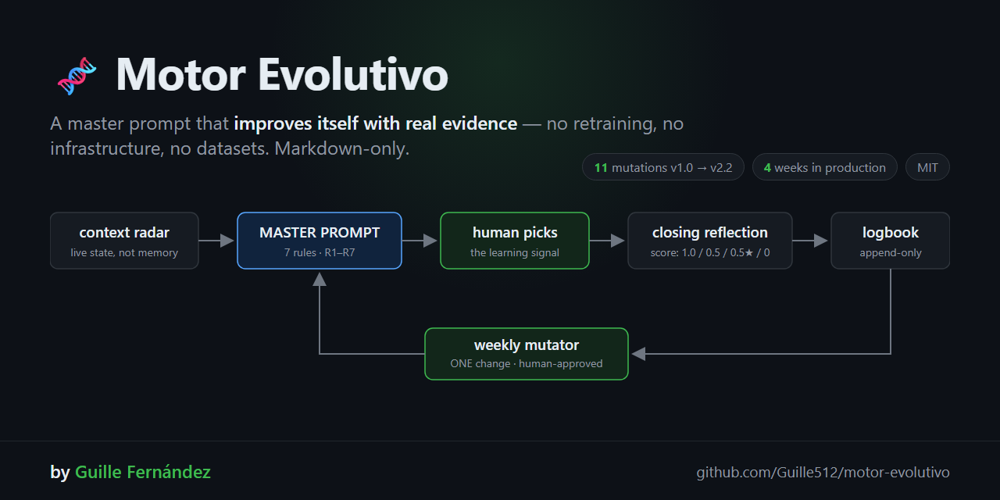

# Motor Evolutivo 🧬 — por [Guille Fernández](https://github.com/Guille512)

🇬🇧 **[Read in English](README.md)** · 🇪🇸 Estás leyendo la versión en español

[](LICENSE)
[](https://github.com/Guille512/motor-evolutivo)
[]()
[](https://claude.com/claude-code)

**Un prompt maestro que se mejora a sí mismo con evidencia real — sin reentrenar nada, sin infraestructura, sin datasets.**



> 🖥️ **Funciona en cualquier terminal, con cualquier agente LLM.** El núcleo es
> markdown puro — no depende de Claude Code. Corre igual con Cursor, Windsurf,
> aider, Gemini CLI, Copilot Chat, o pegando el prompt directo en cualquier chat
> web. Claude Code es la ÚNICA parte opcional (una skill que automatiza el
> ciclo) — si no lo usás, el protocolo funciona exactamente igual a mano.

---

## ¿Qué es?

La mayoría de los frameworks de auto-mejora de prompts ([GEPA](https://github.com/gepa-ai/gepa), DSPy) son **librerías de código**: necesitás Python, datasets de evaluación y un pipeline de optimización.

El Motor Evolutivo es otra cosa: un **protocolo en markdown** que convierte a tu agente LLM en un sistema que aprende de sus propias sesiones de trabajo reales. Sin código obligatorio. Los principios son los mismos que GEPA (reflexión en lenguaje natural > reward numérico), pero el "dataset" son tus sesiones reales y el "optimizador" es un ciclo de reflexión supervisado.

```
  apertura de sesión                cierre de tramo
       │                                  │
       ▼                                  ▼
 radar-contexto ──► PROMPT MAESTRO ──► humano elige ──► reflexión-de-cierre
       ▲                  │                                    │
       │            filtro-novedad                      append a bitácora
       │                                                       │
       └──────────── consolidador ◄──── mutador-de-prompt ◄────┘
                    (cada ~5 usos)      (semanal, con OK humano)
```

**El resultado:** un agente que nunca te propone lo mismo dos veces, que verifica sus premisas antes de proponer, y cuyo prompt maestro es mejor esta semana que la anterior — con changelog versionado en git que lo prueba.

## Las 7 reglas (el corazón)

| Regla | Qué hace | De qué error real nació |
|-------|----------|------------------------|
| **R1 NOVEDAD** | Prohibido repetir lo ya hecho, rechazado o ignorado 2 veces | Jugadas recicladas sesión tras sesión |
| **R2 ORDEN** | Propuesta #1 = siempre el dolor más concreto (error en logs, no idea linda) | Propuestas "interesantes" que ignoraban lo que estaba roto |
| **R3 CURIOSIDAD** | Al menos 1 propuesta 🧪 en dirección no explorada | Convergencia prematura (principio Pareto de GEPA) |
| **R4 FUNDAMENTO** | Cada propuesta cita su fuente: histórico / presente / roadmap | Propuestas sin ancla verificable |
| **R5 SUPERVISIÓN** | Proponer, NUNCA ejecutar producción solo | Un incidente de producción real |
| **R6 REVALIDAR** | Al afirmar "X está roto/sano", pegar la evidencia (log, timestamp) EN la misma frase | 11+ afirmaciones sin verificar encontradas en bitácora |
| **R7 VERIFICAR-PRE** | Antes de proponer "reparar X", verificar que X esté roto de verdad | Propuestas de arreglos fantasma sobre memoria desactualizada |

Ninguna regla salió de la teoría. **Todas son cicatrices**: cada una tiene la fecha y el error que la generó en el changelog.

## La métrica (v1.3 — anti-saturación + self-correction)

Cada cierre de tramo registra en la bitácora qué propuesta se eligió:

| Score | Significado |
|-------|-------------|
| **1.0** | Elegida tal como se propuso |
| **0.5** | Absorbida / reformulada por el humano |
| **0.5★** | **AUTO-CORREGIDA**: R7 anuló la propuesta por premisa falsa ANTES de tocar prod. Señal POSITIVA — el motor cazó su propia mala jugada |
| **0** | Ignorada o rechazada estando bien fundada |

Dos protecciones que aprendimos a los golpes:
- **Prohibido contar absorbidas como elegidas** — eso infló nuestra curva a un 93% falso y la dejó sin señal.
- **Toda entrada nombra la propuesta más floja** — una bitácora donde todo sale bien no enseña nada.

## Resultados reales (no benchmark — producción)

Corriendo desde junio 2026 sobre 3 proyectos en producción (automatización N8N para clínicas + agencia):

- **12 mutaciones aprobadas** del prompt maestro (v1.0 → v2.3) en ~4 semanas, cada una fundada en ejecuciones reales — [historial completo fechado, sanitizado →](docs/CHANGELOG-HISTORY.md) (en inglés)
- **El motor se auto-detecta:** la curva de efectividad saturada al 93% disparó la redefinición de su propia métrica. R6 falló contra su propio autor → generó su versión operativa. La métrica castigaba al mejor mecanismo de seguridad → se corrigió sola en la siguiente ventana.
- **Curva de efectividad ~50%** post-corrección — y eso es lo sano: 100% significa que tu métrica está rota, no que tu agente es perfecto.
- **v2.0a — autonomía acotada:** las propuestas medibles declaran un `sensor:` (métrica + ventana + umbral) y un script 0-tokens las mide solo y propone el score con evidencia. Principio: **automatizar la EVIDENCIA, nunca la DECISIÓN.**
- **v2.1 — Dream Review:** la reflexión de cierre ahora también revisa la bitácora buscando la misma tarea *manual* repetida 3+ veces sin automatización propia — y sugiere el prompt exacto (pegable) para empaquetarla como skill. Solo sugerencia; el humano decide (R5 intacta).
- **v2.2 — estado diferida:** la métrica agrega un estado `D` (diferida) para propuestas que nadie decidió en el tramo — no cuenta como 0 ni como 1.0, se reporta aparte como `% diferidas`, para que un patrón de "proponer sin cerrar" no se esconda detrás de un score que se ve sano.
- **v2.3 — routing de ejecución (R8):** cada jugada propuesta debe nombrar su ejecutor más barato capaz (otro agente del roster, un script 0-tokens, un modelo barato) — el agente que razona solo ejecuta lo que nadie más puede. Jugada sin ejecutor = incompleta. Nació de señal real: jugadas diferidas por falta de dueño, y el agente caro ejecutando trabajo que uno barato podía hacer.

El trabajo de cliente detrás de estos números tiene NDA, así que la bitácora privada completa no se puede publicar — pero [`examples/bitacora-ejemplo.md`](examples/bitacora-ejemplo.md#003) incluye una **entrada real, sanitizada** (detalles identificatorios reemplazados, mecánica y score intactos): un chequeo R7 verify-first que evitó que datos reales de un cliente se filtraran a un asset público, con score 0.5★ (auto-corrección, no una falla).

## Quickstart (5 minutos, cualquier terminal)

Ningún paso de acá abajo requiere Claude Code — son archivos de texto que pegás
en la conversación con tu agente, sea cual sea la terminal o el chat que uses.

1. **Copiá** [`prompts/motor-evolutivo-template.md`](prompts/motor-evolutivo-template.md) a tu repo y completá los `{{placeholders}}` (nombre del agente, proyecto, dónde vive tu roadmap).
2. **Creá la bitácora** — un archivo `learnings/aprendizajes.md` con el header del template (o copiá [`examples/bitacora-ejemplo.md`](examples/bitacora-ejemplo.md)).
3. **Al abrir sesión de trabajo:** pegale el prompt maestro a tu agente (Claude Code, Cursor, aider, ChatGPT, el que uses) → te da máx. 3 propuestas con las reglas R1-R7 aplicadas.
4. **Al cerrar el tramo:** pegale el sub-prompt `reflexión-de-cierre` (≤5 líneas) → append a la bitácora con `Efectividad: X/Y`.
5. **Una vez por semana:** el mutador propone UNA mejora al prompt maestro basada en las últimas 5 reflexiones. La aprobás → changelog. La rechazás → eso también es señal y va a la bitácora.

**Opcional — solo si usás Claude Code:**
- Instalá [`skill/SKILL.md`](skill/SKILL.md) en `~/.claude/skills/motor-evolutivo/` — el ciclo completo (pasos 3-5) se opera diciendo "motor", sin copiar/pegar nada a mano.
- **Sensores 0-token:** [`scripts/watch-sensores.js`](scripts/watch-sensores.js) es Node.js puro — corre en cualquier terminal (no solo Claude Code) por cron/Task Scheduler, mide el resultado de las propuestas aplicadas (vía API de tu stack) y avisa por Telegram, sin gastar tokens de ningún LLM.

## Estructura del repo

```
├── prompts/motor-evolutivo-template.md   ← EL prompt maestro (plantilla genérica)
├── skill/SKILL.md                        ← operador del ciclo para Claude Code
├── scripts/watch-sensores.js             ← score-collector 0-token (opcional)
├── examples/bitacora-ejemplo.md          ← bitácora con entradas de ejemplo
└── docs/arquitectura-autonomia.md        ← el plan v2.0 completo (qué automatizar y qué NO)
```

## Cuándo NO usarlo

- Si querés optimización automática masiva contra un dataset → usá [GEPA](https://github.com/gepa-ai/gepa) directo, es para eso.
- Si nadie va a hacer la reflexión de cierre → sin ese paso el motor NO evoluciona; es un prompt estático con otro nombre.
- Si querés que el agente ejecute producción sin supervisión → este protocolo es explícitamente lo contrario (R5). La señal de aprendizaje ES la decisión humana; sacala y el motor se puntúa solo (ya vimos cómo termina: curva inflada sin información).

## Fundamento

| Principio | Fuente |
|-----------|--------|
| La reflexión en lenguaje natural supera al reward numérico | [GEPA — "Reflective Prompt Evolution Can Outperform Reinforcement Learning" (arXiv 2507.19457)](https://arxiv.org/abs/2507.19457) |
| Try → Reflect → Consolidate sin reentrenar | ACE (Agentic Context Engineering) |
| Árbol de candidatos, no convergencia prematura | GEPA (selección Pareto) |
| El prompt como proceso revisable, versionado en git | Survey de memoria de agentes 2026 |

## Atribución

Si este protocolo (las reglas R1-R7, la métrica v1.3, o el patrón de sensores
de autonomía acotada) aparece en tu propio artículo, charla o producto, un
link de vuelta acá se agradece — es lo único que mantiene la conexión con
el origen:

> Motor Evolutivo — Guillermo Fernández, 2026. https://github.com/Guille512/motor-evolutivo

## Privacidad y seguridad

Sin telemetría, sin cuenta, sin API key para el protocolo core — es markdown
que pegás en tu propio agente. El único script opcional solo llama a las
APIs que VOS configurás, nunca manda datos a ningún lado. Política completa
(en inglés): [SECURITY.md](SECURITY.md).

## Licencia

MIT — [Guillermo Fernández](https://github.com/Guille512). Si lo usás y el motor te enseña algo, contá la cicatriz en un issue: las reglas de otros son el mejor changelog.
