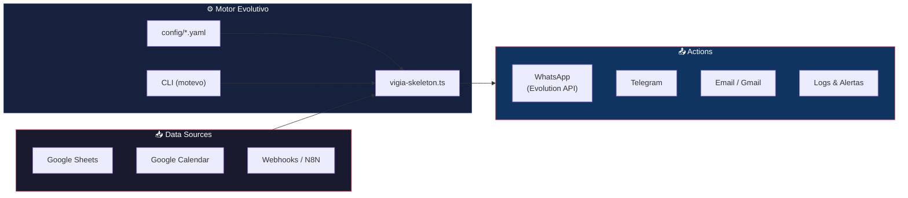

# motor-evolutivo

> **A high‑impact, open‑source portfolio showcasing the *Motor Evolutivo* – a lightweight, extensible framework for AI‑driven automation, data pipelines, and intelligent monitoring.**

[](https://github.com/Guille512/motor-evolutivo/actions/workflows/ci.yml)
[](https://opensource.org/licenses/MIT)
[](https://nodejs.org/)

---

## 📖 Overview

`motor-evolutivo` is a **modular, language‑agnostic toolkit** built to:

- **Orchestrate AI‑driven workflows** (LLM prompts, sensor data, watchdogs).
- **Provide reusable "vigía" skeletons** for monitoring cron‑jobs, N8N integrations, and custom health‑checks.
- **Expose a clean CLI** (`motevo`) for rapid prototyping, testing, and deployment.
- **Serve as a showcase** of best‑practice engineering for the **automation ecosystem**.

The project is deliberately **client‑agnostic** – all configuration lives in `config/` and the core engine never contains hard‑coded credentials or client identifiers.

---

## 🏗️ Architecture



**Flujo típico:**  
`Fuente de datos` → `Vigía` (lee config YAML) → `Acción` (notifica, registra, escala)

---

## 🗂️ Repository Structure

```
motor-evolutivo/
├─ .github/workflows/ci.yml        # CI: lint, test, build
├─ config/
│   ├─ vigia.yaml                   # Example vigía definitions
│   └─ system.yaml                  # System‑wide defaults
├─ docs/
│   └─ architecture.md              # Component diagram & design decisions
├─ examples/
│   └─ cancelaciones-clinica/       # 🦷 Real‑world sanitized example
│       ├─ README.md
│       └─ index.ts
├─ scripts/
│   └─ pre-commit-secrets.sh        # 🔒 Secret detection hook
├─ src/
│   ├─ index.ts                     # Public exports
│   ├─ vigia/vigia-skeleton.ts      # Core vigía class
│   └─ cli/motevo.ts                # CLI entry point
├─ tests/                           # Unit & integration tests
├─ .env.example                     # 🔑 Required env vars (NO secrets)
├─ .gitignore                       # Excludes .env, node_modules, etc.
├─ LICENSE                          # MIT
├─ package.json
└─ tsconfig.json
```

---

## ✨ Features

- **Unified vigía skeleton** (`vigia-skeleton.ts`) – plug‑and‑play for any periodic task.
- **Config‑first design** – all behavior driven by YAML; no code changes required for new clients.
- **CLI (`motevo`)** – `motevo run <vigia>` runs a vigía with dry‑run, summary, and force flags.
- **Extensible plugin system** – add custom collectors, notifiers (Telegram, Slack, email).
- **Zero secrets** – the repo contains no private keys; tokens are loaded from environment at runtime.
- **CI pipeline** – lint, test, type‑check on every push.

---

## 🚀 Quick Start

```bash
# clone the repo
git clone https://github.com/Guille512/motor-evolutivo.git
cd motor-evolutivo

# configure environment
cp .env.example .env
# edit .env with your actual credentials

# install dependencies (Node ≥20)
npm ci

# run the cancellation example (dry‑run)
npm run motevo -- run cancelaciones-clinica --dry-run
```

> **Tip:** Use `npm run motevo -- --help` to explore all CLI options.

---

## 📦 Installation (as a library)

```bash
npm install motor-evolutivo
```

```ts
import { createVigia } from "motor-evolutivo";

const vigia = createVigia({ name: "my-monitor", cron: "*/5 * * * *" });
await vigia.run();
```

---

## 🔒 Security

This repository follows strict security practices:

| Practice | Implementation |
|---|---|
| **No secrets in code** | All credentials loaded from environment variables via `.env` |
| **`.env.example` template** | Shows required vars without real values |
| **Pre-commit hook** | Scans staged files for API keys, tokens, and passwords |
| **`.gitignore`** | Excludes `.env`, `node_modules/`, `dist/`, logs |

### Installing the pre-commit hook

```bash
cp scripts/pre-commit-secrets.sh .git/hooks/pre-commit
chmod +x .git/hooks/pre-commit
```

The hook will **block commits** that contain patterns like `API_KEY=`, `TOKEN=`, or `Bearer` tokens. Use `git commit --no-verify` to bypass (only if you're sure it's a false positive).

---

## 🛠️ Development & Testing

- **Linting & Formatting** – `npm run lint` (ESLint + Prettier).
- **Unit tests** – `npm test` (Jest).
- **Type checking** – `npm run typecheck`.

---

## 🤝 Contributing

1. Fork the repository.
2. Create a feature branch (`git checkout -b feat/awesome-feature`).
3. Follow the **conventional commits** style.
4. Open a Pull Request – CI will run automatically.

---

## 📜 License

`motor-evolutivo` is released under the **MIT License** – see the [`LICENSE`](./LICENSE) file for details.

---

## 🙏 Acknowledgements

- **Guillermo Fernández** – vision and real‑world automation use‑cases.
- **Open‑source community** – for the tools that power the CI pipeline (Jest, ESLint, TypeScript).

---

> **Ready to automate?** Clone, explore the [`examples/`](./examples) folder, and adapt the vigías for your own projects.
