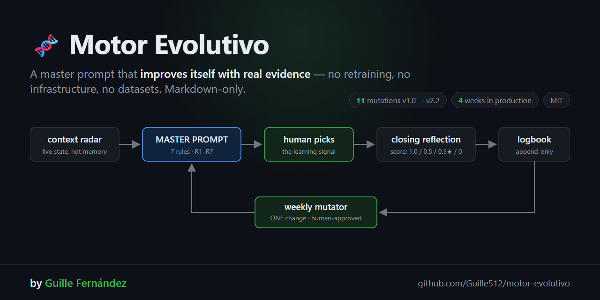
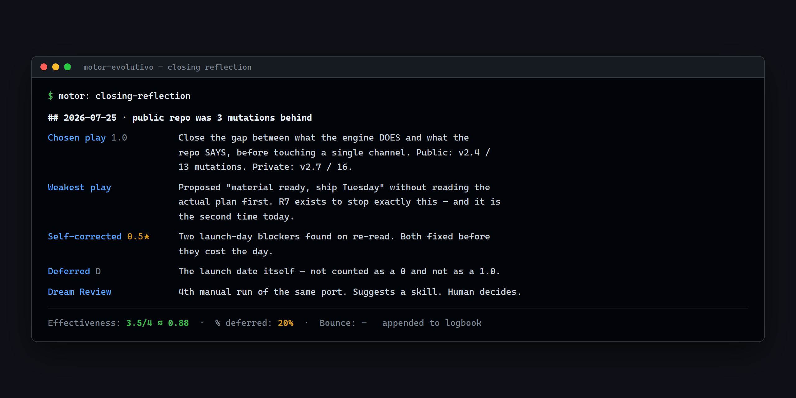

# Motor Evolutivo 🧬 — by [Guille Fernández](https://github.com/Guille512)

🇪🇸 **[Leer en español](README.es.md)** · 🇬🇧 You're reading the English version

[](LICENSE)
[](https://github.com/Guille512/motor-evolutivo)
[]()
[](https://claude.com/claude-code)

**A master prompt that improves itself with real evidence — no retraining, no infrastructure, no datasets.**



> 🖥️ **Works in any terminal, with any LLM agent.** The core is plain
> markdown — it doesn't depend on Claude Code. It runs the same way with
> Cursor, Windsurf, aider, Gemini CLI, Copilot Chat, or by pasting the
> prompt directly into any web chat. Claude Code is the ONLY optional part
> (a skill that automates the cycle) — if you don't use it, the protocol
> works exactly the same by hand.

---

## What is this?

Most prompt self-improvement frameworks ([GEPA](https://github.com/gepa-ai/gepa), DSPy) are **code libraries**: you need Python, evaluation datasets, and an optimization pipeline.

Motor Evolutivo is something else: a **markdown protocol** that turns your LLM agent into a system that learns from its own real work sessions. No code required. The principles are the same as GEPA (natural-language reflection beats numeric reward), but the "dataset" is your actual sessions and the "optimizer" is a supervised reflection cycle — the human closing the loop each time, not a rollout harness.

```
   session opens                    task chunk closes
       │                                  │
       ▼                                  ▼
 context-radar ──► MASTER PROMPT ──► human picks ──► closing-reflection
       ▲                  │                                │
       │            novelty-filter                   append to logbook
       │                                                    │
       └──────────── consolidator ◄──── prompt-mutator ◄────┘
                    (every ~5 uses)      (weekly, human-approved)
```

**The result:** an agent that never proposes the same thing twice, that verifies its assumptions before suggesting a fix, and whose master prompt is measurably better this week than last week — with a git-versioned changelog to prove it.

## The 9 rules (the core of it)

| Rule | What it does | Which real failure it came from |
|------|---------------|----------------------------------|
| **R1 NOVELTY** | Never repeat a move already done, rejected, or ignored twice | Recycled proposals, session after session |
| **R2 ORDERING** | Proposal #1 is always the most concrete real pain (an actual error in the logs, not a nice idea) | "Interesting" proposals that ignored what was actually broken |
| **R3 CURIOSITY** | At least 1 proposal 🧪 in an unexplored direction | Premature convergence (GEPA's Pareto principle) |
| **R4 GROUNDING** | Every proposal cites its source: historical / current / roadmap | Proposals with no verifiable anchor |
| **R5 SUPERVISION** | Propose, NEVER execute production alone | A real production incident |
| **R6 REVALIDATE** | When claiming "X is broken/healthy," paste the evidence (log, timestamp) IN the same sentence | 11+ unverified claims found in the logbook |
| **R7 VERIFY-BEFORE-PROPOSING** | Before proposing "fix X," verify X is actually broken. **R7-b:** before ruling on *another agent's* proposal, read the real code it touches — and demand the new capability before the tidiness | Phantom-fix proposals based on stale memory · verdicts written about a text instead of the codebase |
| **R8 EXECUTION ROUTING** | Every proposal names its cheapest capable executor; the reasoning agent only does what nobody else can | Plays deferred for lack of an owner + the expensive agent doing cheap work |
| **R9 OWN KNOWLEDGE** | Re-read what you already wrote down about a tool before using it | 3 errors the agent already had the documented fix for, unconsulted |

None of these rules came from theory. **They're all scars** — each one has the date and the failure that caused it in the changelog.

## The metric (v1.3 — anti-saturation + self-correction)

Every closed task chunk logs which proposal was picked:

| Score | Meaning |
|-------|---------|
| **1.0** | Chosen exactly as proposed |
| **0.5** | Absorbed / reworded by the human |
| **0.5★** | **SELF-CORRECTED**: R7 nulled the proposal on a false premise BEFORE touching prod. A POSITIVE signal — the engine caught its own bad move |
| **0** | Ignored or rejected while well-founded |

Two protections we learned the hard way:
- **Absorbed proposals must never count as chosen** — that inflated our curve to a false 93% and left it with zero signal.
- **Every logbook entry names the weakest proposal** — a logbook where everything looks great teaches nothing.

## Real results (not a benchmark — production)



> A **real closing reflection** — this one from the chunk that produced this very
> README update (2026-07-25). Sanitized (client names removed) and typeset for
> legibility; the scores, the named weakest play and the self-correction are
> verbatim from the logbook. Source: [`docs/reflection-example.html`](docs/reflection-example.html).


Running since June 2026 across 3 production projects (N8N automation for dental clinics + an agency):

- **17 approved mutations** of the master prompt (v1.0 → v2.8) in ~8 weeks, each grounded in real executions — [full dated history, sanitized →](docs/CHANGELOG-HISTORY.md)
- **The engine catches itself:** an effectiveness curve saturated at 93% triggered a redefinition of its own metric. R6 failed against its own author → it produced its own operative version. The metric was punishing the best safety mechanism → it corrected itself the following window.
- **~50% effectiveness curve** post-correction — and that's the healthy number: 100% means your metric is broken, not that your agent is perfect.
- **v2.0a — bounded autonomy:** measurable proposals declare a `sensor:` (metric + window + threshold), and a 0-token script measures them on its own and proposes the score with evidence. Principle: **automate the EVIDENCE, never the DECISION.**
- **v2.1 — Dream Review:** the closing reflection now also checks the logbook for the same *manual* task repeated 3+ times without its own automation — and suggests the exact paste-ready prompt to package it as a skill. Suggestion only; the human decides (R5 intact).
- **v2.2 — deferred state:** the metric adds a `D` (deferred) state for proposals nobody decided on this chunk — it doesn't count as a 0 or a 1.0, it's tracked separately as `% deferred`, so a "propose without follow-through" pattern can't hide inside a healthy-looking score.
- **v2.3 — execution routing (R8):** every proposed play must name its cheapest capable executor (another agent in your roster, a 0-token script, a cheap model) — the reasoning agent only executes what nobody else can. A play without an executor is incomplete. Born from real signal: plays kept getting deferred for lack of an owner, and the expensive agent kept executing work a cheaper one could do.
- **v2.4 — delegation bounce:** the closing reflection gains a mandatory `Bounce: X/N` line — how many delegated deliverables had to be bounced back for correction, out of those verified this chunk. Effectiveness measures what the orchestrator *proposes*; bounce measures what the ecosystem *delivers*. Born from a multi-agent ecosystem analysis: the curve had been flat at 100% for 12-13 chunks (a broken-metric smell) and coordination — not capability — was the dominant cost.
- **v2.5 — own knowledge (R9):** before invoking a tool, designing an artifact or recommending one in a play, the agent must re-read the findings it *already wrote down* (memory, the component's own doc, the logbook) and apply them on the first try. Distinct from R6 (read the real component) and R7 (verify system state): R9 targets knowledge that already exists in writing and simply wasn't consulted. Born from 3 real occurrences across 2 chunks of the exact same pattern — the agent had the knowledge to prevent the error, caught it only in later self-correction, and paid avoidable cycles.
- **v2.8 — the engine learned to audit instead of opine:** it had a rule for verifying its *own*
  assumptions before proposing, and none for the case that had quietly become frequent —
  *evaluating what another agent proposes*. R7-b now forces reading the actual code a proposal
  touches before ruling on it. What made the rule: in the verdict that triggered it, 80% of the
  value delivered wasn't the ruling on the five proposals — it was a bug none of them mentioned
  (three API routes silently falling back to one tenant's data when a query param was missing,
  returning 200 all the while). Two filters came with it: **demand the new capability before the
  tidiness** — if "what can you do afterwards that you couldn't before?" answers "nothing, it's
  cleaner", the refactor is debt under another name — and any *move this config into the
  database* proposal must declare what part of it isn't data (a CSS framework's classes don't
  survive static purging from a table; a component isn't serializable).
- **v2.6 / v2.7 — the engine scores itself from real data:** a 0-token collector derives 2 of the 5 dimensions of the agent baseline from evidence instead of judgment. **Autonomy** ← freshness of each loop agent's heartbeat. **Integration** ← close rate of tickets addressed to that agent in the shared channel, penalized by the age of the oldest open one — with an **explicit `N/A` below 3 tickets** (insufficient data is a valid state, not a 0 and not a fake average). Same principle as v2.0a: **automate the evidence, never the decision.** A finding along the way (R7 at work): the files that *looked* like heartbeats were actually the watchers' own dedup state — the real heartbeats lived somewhere else, and the collector was pointed there.

The client work behind these numbers is under NDA, so the full private logbook can't be published — but [`examples/bitacora-ejemplo.md`](examples/bitacora-ejemplo.md#003) includes one **real, sanitized entry** (identifying details replaced, mechanics and score untouched): an R7 verify-first check that caught real client data about to leak into a public asset, scored 0.5★ (self-correction, not a failure).

## Quickstart (5 minutes, any terminal)

Nothing below requires Claude Code — these are plain text files you paste
into the conversation with your agent, whatever terminal or chat you use.

1. **Copy** [`prompts/motor-evolutivo-template.md`](prompts/motor-evolutivo-template.md) into your repo and fill in the `{{placeholders}}` (agent name, project, where your roadmap lives).
2. **Create the logbook** — a `learnings/aprendizajes.md` file with the template's header (or copy [`examples/bitacora-ejemplo.md`](examples/bitacora-ejemplo.md)).
3. **When you open a work session:** paste the master prompt to your agent (Claude Code, Cursor, aider, ChatGPT, whatever you use) → it gives you up to 3 proposals with rules R1-R9 already applied.
4. **When you close the chunk:** paste the `reflexión-de-cierre` sub-prompt (≤5 lines) → append to the logbook with `Efectividad: X/Y`.
5. **Once a week:** the mutator proposes ONE improvement to the master prompt based on the last 5 reflections. You approve it → changelog. You reject it → that's also signal, and it goes in the logbook too.

**Optional — only if you use Claude Code:**
- Install [`skill/SKILL.md`](skill/SKILL.md) into `~/.claude/skills/motor-evolutivo/` — the full cycle (steps 3-5) runs by just saying "motor," no manual copy/paste.
- **0-token sensors:** [`scripts/watch-sensores.js`](scripts/watch-sensores.js) is plain Node.js — runs in any terminal (not just Claude Code) via cron/Task Scheduler, measures the outcome of applied proposals (via your stack's API) and alerts over Telegram, without spending a single LLM token.

## Repo structure

```
├── prompts/motor-evolutivo-template.md   ← THE master prompt (generic template)
├── skill/SKILL.md                        ← Claude Code cycle operator
├── scripts/watch-sensores.js             ← 0-token score-collector (optional)
├── examples/bitacora-ejemplo.md          ← example logbook with sample entries
└── docs/arquitectura-autonomia.md        ← the full v2.0 plan (what to automate and what NOT to)
```

## When NOT to use it

- If you want massive automatic optimization against a dataset → use [GEPA](https://github.com/gepa-ai/gepa) directly, that's what it's built for.
- If nobody is going to do the closing reflection → without that step the engine does NOT evolve; it's just a static prompt with a different name.
- If you want the agent to execute production unsupervised → this protocol is explicitly the opposite (R5). The learning signal IS the human decision; remove it and the engine scores itself (we've seen how that ends: an inflated curve with zero information).

## Grounding

| Principle | Source |
|-----------|--------|
| Natural-language reflection beats numeric reward | [GEPA — "Reflective Prompt Evolution Can Outperform Reinforcement Learning" (arXiv 2507.19457)](https://arxiv.org/abs/2507.19457) |
| Try → Reflect → Consolidate without retraining | ACE (Agentic Context Engineering) |
| Candidate tree, not premature convergence | GEPA (Pareto selection) |
| The prompt as a revisable process, versioned in git | 2026 agent-memory survey |

## Attribution

If this protocol (the R1-R9 rule set, the v1.3 metric, or the bounded-autonomy
sensor pattern) shows up in your own writeup, talk, or product, a link back
here is appreciated — it's what keeps this tied to where it came from:

> Motor Evolutivo — Guillermo Fernández, 2026. https://github.com/Guille512/motor-evolutivo

## Privacy & security

No telemetry, no account, no API key needed for the core protocol — it's
markdown you paste into your own agent. The one optional script only calls
APIs **you** configure, never phones home. Full policy: [SECURITY.md](SECURITY.md).

## License

MIT — [Guillermo Fernández](https://github.com/Guille512). If you use it and the engine teaches you something, tell the scar in an issue: other people's rules are the best changelog.
